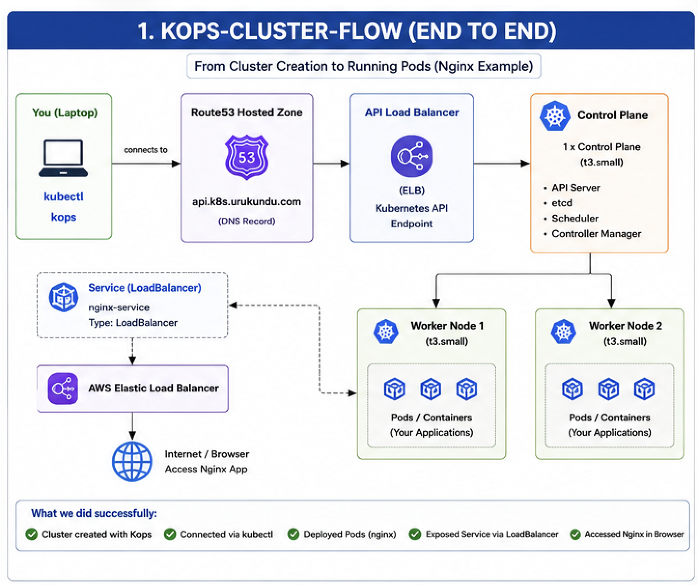
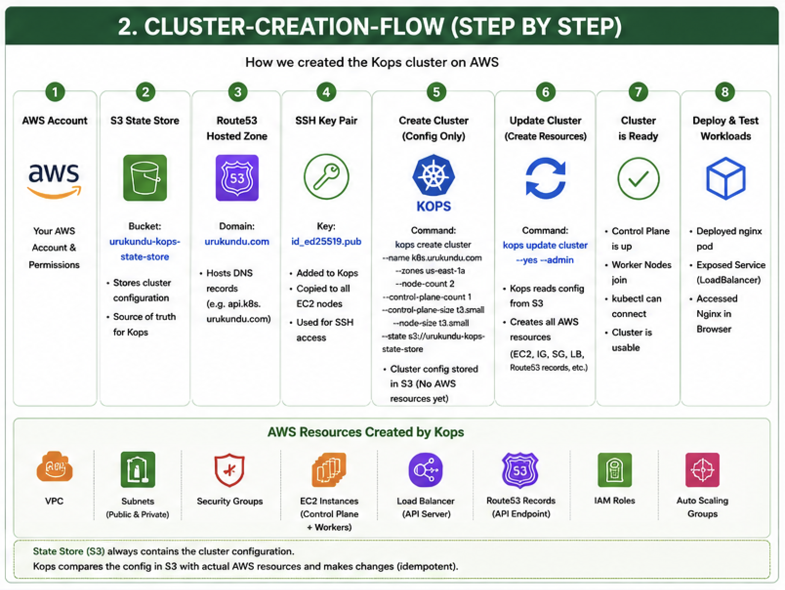
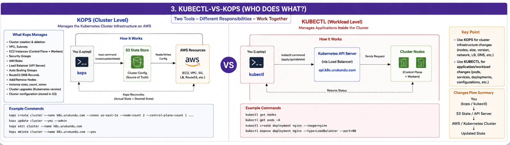
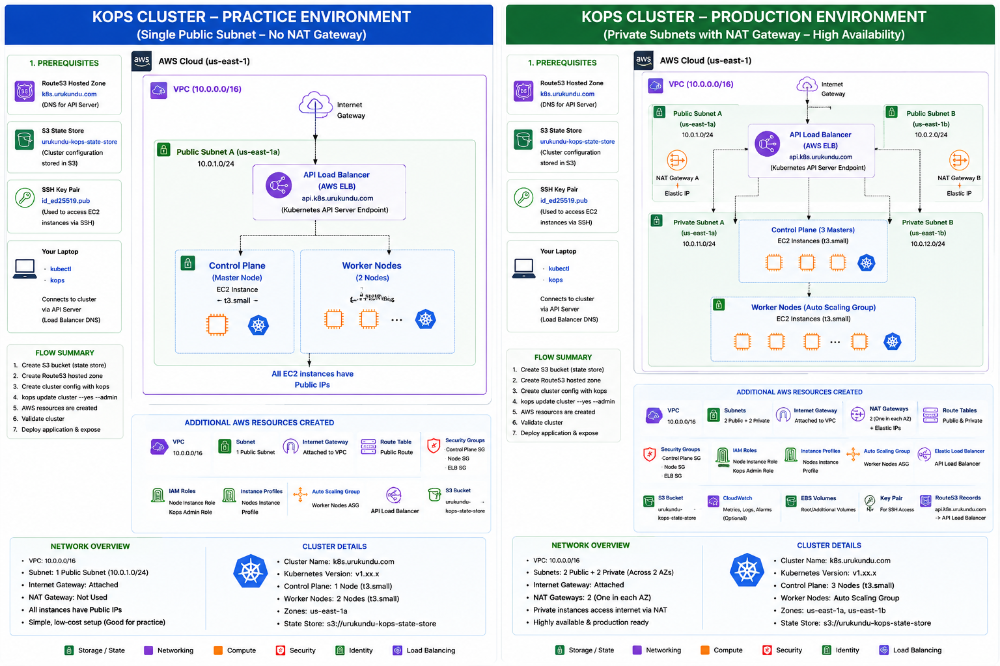

# 🚀 Kubernetes Cluster Creation with Kops on AWS


## 📖 Overview
This repository contains a complete end-to-end Kubernetes cluster setup on AWS using Kops.

Features:

- AWS CLI Setup
- kubectl Installation
- Kops Installation
- Route53 Hosted Zone Configuration
- S3 State Store
- SSH Key Configuration

---

## 📚 Docs Structure
- [`docs/README.md`](docs/README.md) — documentation entry point
- [`docs/cluster-creation-guide.md`](docs/cluster-creation-guide.md) — full cluster creation workflow
- [`docs/diagram-descriptions.md`](docs/diagram-descriptions.md) — visual diagram explanations
- [`docs/SUMMARY.md`](docs/SUMMARY.md) — docs navigation summary

---

## 🏗️ Architecture Diagrams

### 1. End-to-End Kops Flow


### 2. Cluster Creation Flow


### 3. Kops vs kubectl


### 4. Practice vs Production Architecture


---

## 📘 Diagram Details
For more context on each image, see [docs/diagram-descriptions.md](docs/diagram-descriptions.md).

---

## ⚙️ Prerequisites

| Requirement | Description |
|---|---|
| AWS Account | Active AWS Account |
| Domain | Route53 Compatible Domain |
| AWS CLI | Installed and Configured |
| kubectl | Kubernetes CLI |
| kops | Kubernetes Operations Tool |
| SSH Key | `~/.ssh/id_ed25519.pub` |

---

## 🔧 Installation

### Install AWS CLI

```bash
brew install awscli
aws configure
```

### Install kubectl

```bash
brew install kubectl
```

### Install Kops

```bash
brew install kops
```

---

## 🪣 Create S3 State Store

```bash
aws s3 mb s3://urukundu-kops-state-store
```

```bash
aws s3api put-bucket-versioning \
  --bucket urukundu-kops-state-store \
  --versioning-configuration Status=Enabled
```

```bash
export KOPS_STATE_STORE=s3://urukundu-kops-state-store
```

---

## 🌐 Create Route53 Hosted Zone

```bash
aws route53 create-hosted-zone \
  --name urukundu.com \
  --caller-reference $(date +%s)
```

Verify:

```bash
dig NS urukundu.com
```

---

## ☸️ Create Kubernetes Cluster

```bash
kops create cluster \
  --name k8s.urukundu.com \
  --state s3://urukundu-kops-state-store \
  --zones us-east-1a \
  --node-count 2 \
  --node-size t3.small \
  --control-plane-count 1 \
  --control-plane-size t3.small \
  --ssh-public-key ~/.ssh/id_ed25519.pub
```

Apply:

```bash
kops update cluster \
  --name k8s.urukundu.com \
  --yes \
  --admin
```

---

## ✅ Validation

```bash
kops validate cluster
```

```bash
kubectl get nodes
```

```bash
kubectl get pods -A
```

---

## 🚀 Deploy Nginx

```bash
kubectl create deployment nginx --image=nginx
```

```bash
kubectl expose deployment nginx \
  --port=80 \
  --type=LoadBalancer
```

```bash
kubectl get svc
```

---

## 🧹 Cleanup

```bash
kubectl delete svc nginx
kubectl delete deployment nginx
```

```bash
kops delete cluster \
  --name k8s.urukundu.com \
  --yes
```

---

## 📚 Learning Outcomes

- Kubernetes Fundamentals
- Kops Administration
- AWS Networking
- Route53 DNS
- S3 State Store
- IAM Roles & instance Profiles
- Load Balancers
- Kubernetes Services
- Kubernetes Deployments
